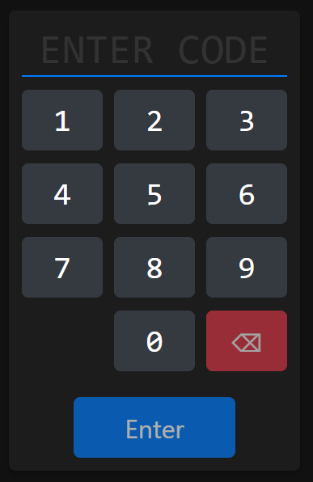

# Home Assistant Garage Door Keypad
This project allows Home Assistant to host a publically exposed page allowing someone to enter a sequence of digits like those old RF garage door keypads.



## Setup
1. Copy/merge the contents of the `/config` folder into your own. Additionally:
    * This project requires [Home Assistant Packages](https://www.home-assistant.io/docs/configuration/packages/) turned on in `configuration.yaml`
	* Update your `secrets.yaml` file to include an `garage_door_code_webhook_id` entry
2. Update the automation in `/config/packages/garage_door_keypad.yaml`:
    * Update the `notify.notify` service calls (or remove them if you don't want notifications)
	* Update the garage-open service (do a Ctrl+F for "WEBHOOK_ACTION")
3. Set the value of the `input_text.garage_door_code` entity in Home Assistant
4. Create an NFC tag with a URL that points to:

    ```
    https://YOUR_HA_INSTANCE:PORT/local/garage_door_code/index.html?webhook_id=YOUR_GARAGE_DOOR_CODE_WEBHOOK_ID
    ```

5. And you're done! ✅

## Notes/Use
* The interface is mobile-specific &mdash; it's tested on Chrome/Android10, and Safari/iOS14
* The interface features dark/light mode
* In your Home Assistant instance, you can modify the keypad code via `input_text.garage_door_code`. If you set it to a blank value (empty string), the system will be "disabled" and no codes will work.
* The `timer.until_garage_door_code_can_be_used` controls a server-side cooldown (so that nobody can rapidly brute-force the codes) &mdash; if you change its duration, make sure to change the `COOLDOWN` constant in `script.js`
* Because the webhook ID is placed in the URL, it is **PUBLICALLY EXPOSED TO ANYONE THAT HAS ACCESS TO THE NFC TAG!** The automation doesn't allow you to perform any other actions with the webhook ID, as long as you make sure you don't use it in place of other webhooks that expose other services.